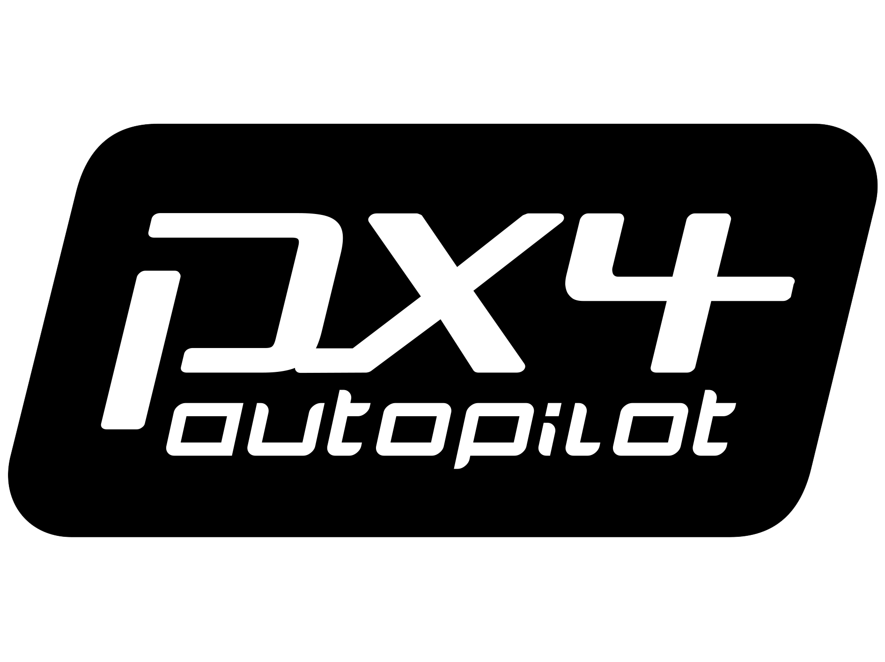

# UAV Gazebo Simulation Environment

<div align="center">




**A comprehensive UAV simulation framework integrating PX4, ROS 2 Jazzy, and Gazebo Harmonic**

[](LICENSE)
[](https://docs.ros.org/en/jazzy/)
[](https://gazebosim.org/)
[](https://px4.io/)

</div>

## 🚁 Overview

This simulation environment provides a complete UAV development and testing platform, featuring high-fidelity physics simulation, realistic sensor models, and seamless integration between PX4 autopilot and ROS 2. Perfect for developing autonomous drone applications, computer vision algorithms, and flight control systems.

### 🌟 Key Features

- **🔧 Complete Toolchain**: PX4 + ROS 2 Jazzy + Gazebo Harmonic integration
- **🎮 Advanced Models**: X500 quadcopter with Intel RealSense D435 depth camera
- **🌐 Multi-Environment**: Support for various simulation worlds and scenarios
- **🐳 Docker Ready**: Containerized development environment for consistent setup
- **🚀 High Performance**: Optimized for real-time simulation and visualization
- **📡 Communication**: Built-in XRCE-DDS and Zenoh middleware support

## 🛠️ What's Included

<div align="center">

<table>
  <thead>
    <tr>
      <th>Component</th>
      <th>Description</th>
      <th>Version</th>
    </tr>
  </thead>
  <tbody>
    <tr>
      <td></td>
      <td><strong>ROS 2 Jazzy</strong><br>Complete robotics middleware</td>
      <td>Latest</td>
    </tr>
    <tr>
      <td></td>
      <td><strong>Gazebo Harmonic</strong><br>Physics simulation engine</td>
      <td>Latest</td>
    </tr>
    <tr>
      <td></td>
      <td><strong>PX4 Autopilot</strong><br>Flight control stack</td>
      <td>v1.14+</td>
    </tr>
    <tr>
      <td></td>
      <td><strong>QGroundControl</strong><br>Ground control station</td>
      <td>Latest</td>
    </tr>
    <tr>
      <td></td>
      <td><strong>RViz2</strong><br>3D visualization tool</td>
      <td>Jazzy</td>
    </tr>
    <tr>
      <td></td>
      <td><strong>Zenoh Middleware</strong><br>High-performance communication</td>
      <td>Latest</td>
    </tr>
  </tbody>
</table>

</div>

## 🎯 Simulation Showcase

<div align="center">

### Gazebo Simulation Environment

*High-fidelity UAV simulation with realistic physics and sensor models*

### QGroundControl Integration

*Real-time monitoring and control interface*

### RViz2 Visualization

*Advanced 3D visualization and debugging tools*

</div>

## 🚀 Quick Start

### Option 1: Automated Installation (Recommended)

```bash
# Clone the repository
git clone https://github.com/asmbatati/uav_gz_sim.git
cd uav_gz_sim

# Set environment variables
export DEV_DIR=$(pwd)/..
export GIT_USER=your_github_username  # Optional
export GIT_TOKEN=your_github_token    # Optional

# Run the installation script
chmod +x install.sh
./install.sh
```

### Option 2: Docker Environment

```bash
# Navigate to Docker setup
cd px4_ros2_jazzy_docker

# Build and run the container
chmod +x docker-compose-run.sh
./docker-compose-run.sh up --profile gpu

# Access the container
./docker-compose-run.sh shell
```

## 📋 Prerequisites

### System Requirements

- **OS**: Ubuntu 22.04/24.04 LTS or WSL2
- **RAM**: Minimum 8GB (16GB recommended)
- **GPU**: NVIDIA GPU recommended for optimal performance
- **Storage**: At least 20GB free space

### Dependencies (Auto-installed)

- **ROS 2 Jazzy Desktop**: Complete robotics development stack
- **Gazebo Harmonic**: Latest simulation environment
- **PX4 Development Tools**: Firmware development and simulation
- **Python Dependencies**: NumPy, Matplotlib, PyMAVLink, and more
- **Communication Middleware**: Zenoh, XRCE-DDS

## 🏗️ Installation Details

The installation script automatically:

1. **🔍 Environment Detection**: Identifies container vs host environment
2. **📦 Dependency Management**: Installs all required packages
3. **🔧 System Configuration**: Sets up permissions and environment variables
4. **🌐 Repository Cloning**: Downloads PX4, MAVROS, and simulation packages
5. **🏗️ Building**: Compiles all ROS 2 packages with smart retry logic
6. **⚙️ Configuration**: Copies models, worlds, and airframe configurations

## 🎮 Usage

### Launch Simulation

```bash
# Source the workspace
source ~/shared_volume/ros2_ws/install/setup.bash

# Launch the simulation
ros2 launch uav_gz_sim sim.launch.py

# For tugbot depot world
ros2 launch uav_gz_sim sim.launch.py world_type:=tugbot_depot
```

### Start PX4 SITL

```bash
# Navigate to PX4 directory
cd ~/shared_volume/PX4-Autopilot

# Launch X500 with stereo camera and lidar
make px4_sitl gz_x500_twin_stereo_twin_velodyne

# For tugbot depot environment
PX4_GZ_MODEL_POSE="0,0,0.1,0,0,0" make px4_sitl gz_x500_stereo_cam_3d_lidar PX4_GZ_WORLD=tugbot_depot
```

### Ground Control

```bash
# Launch QGroundControl
~/shared_volume/QGroundControl.AppImage

# Or use the alias (after sourcing bash.sh)
qgc
```

## 🛰️ Available Models & Worlds

### UAV Models
- **X500 Quadcopter**: Basic configuration
- **X500 + Intel RealSense D435**: With depth camera
- **X500 + Stereo Cameras**: Dual camera setup
- **X500 + LiDAR**: 3D scanning configuration
- **X500 Complete**: Stereo cameras + dual LiDAR

### Simulation Worlds
- **Default Empty World**: Basic testing environment
- **Tugbot Depot**: Warehouse simulation with obstacles
- **Custom Worlds**: Expandable world configurations

## 🔧 Development

### Building Packages

```bash
# Build specific package
cd ~/shared_volume/ros2_ws
colcon build --packages-select uav_gz_sim

# Build all packages
colcon build

# Source after building
source install/setup.bash
```

### Adding Custom Models

1. Place model files in `models/` directory
2. Add world files to `worlds/` directory  
3. Configure airframes in `config/px4/` directory
4. Rebuild the workspace

## 🤝 Communication Architecture


## 📚 Documentation & Resources

- **[PX4 Documentation](https://docs.px4.io/)** - Complete PX4 development guide
- **[ROS 2 Jazzy Docs](https://docs.ros.org/en/jazzy/)** - ROS 2 development resources
- **[Gazebo Tutorials](https://gazebosim.org/docs)** - Simulation environment guides
- **[QGroundControl User Guide](https://docs.qgroundcontrol.com/)** - Ground station documentation

## 🐛 Troubleshooting

### Common Issues

<details>
<summary><strong>Build Errors with CMake Cache</strong></summary>

```bash
# Clean and rebuild
cd ~/shared_volume/ros2_ws
rm -rf build/ install/ log/
colcon build
```
</details>

<details>
<summary><strong>Serial Port Permissions</strong></summary>

```bash
# Add user to dialout group
sudo usermod -a -G dialout $USER
# Logout and login again
```
</details>

<details>
<summary><strong>GPU Acceleration Issues</strong></summary>

```bash
# Check NVIDIA driver
nvidia-smi

# For WSL2, ensure WSL GPU support is enabled
```
</details>

## 🤝 Contributing

Contributions are welcome! Please feel free to submit issues, feature requests, or pull requests.

1. Fork the repository
2. Create a feature branch (`git checkout -b feature/amazing-feature`)
3. Commit changes (`git commit -m 'Add amazing feature'`)
4. Push to branch (`git push origin feature/amazing-feature`)
5. Open a Pull Request

## 📄 License

This project is licensed under the MIT License - see the [LICENSE](LICENSE) file for details.

## 🙏 Acknowledgments

- **PX4 Development Team** - For the excellent autopilot software
- **Open Robotics** - For ROS 2 and Gazebo simulation tools
- **Eclipse Zenoh** - For high-performance middleware
- **Community Contributors** - For continuous improvements and feedback

---

<div align="center">

**Built with ❤️ for the UAV development community**

[Report Bug](https://github.com/asmbatati/uav_gz_sim/issues) · [Request Feature](https://github.com/asmbatati/uav_gz_sim/issues) · [Documentation](https://github.com/asmbatati/uav_gz_sim/wiki)

</div>