# UAV Gazebo Simulation Environment

<div align="center">


**A comprehensive UAV simulation framework integrating PX4, ROS 2 Jazzy, and Gazebo Harmonic**

[](LICENSE)
[](https://docs.ros.org/en/jazzy/)
[](https://gazebosim.org/)
[](https://px4.io/)
[](https://github.com/mavlink/mavros)
[](https://mavlink.io/)

</div>

## 🚁 Overview

This simulation environment provides a complete UAV development and testing platform, featuring high-fidelity physics simulation, realistic sensor models, and seamless integration between PX4 autopilot and ROS 2. Perfect for developing autonomous drone applications, computer vision algorithms, and flight control systems.

### 🌟 Key Features

- **🔧 Complete Toolchain**: PX4 + ROS 2 Jazzy + Gazebo Harmonic + MAVROS integration
- **🎮 Advanced Models**: X500 quadcopter with Intel RealSense D435 depth camera
- **🌐 Multi-Environment**: Support for various simulation worlds and scenarios
- **🐳 Docker Ready**: Containerized development environment for consistent setup
- **🚀 High Performance**: Optimized for real-time simulation and visualization
- **📡 Communication Middleware**: Zenoh middleware support
- **📡 Dual Communication**: Built-in XRCE-DDS and MAVLink/MAVROS support
- **🛰️ Protocol Flexibility**: Choose between native uXRCE-DDS or classic MAVLink bridges

## 🛠️ What's Included

<div align="center">

<table>
  <thead>
    <tr>
      <th>Component</th>
      <th>Description</th>
      <th>Version</th>
    </tr>
  </thead>
  <tbody>
    <tr>
      <td></td>
      <td><strong>ROS 2 Jazzy</strong><br>Complete robotics middleware</td>
      <td>Latest</td>
    </tr>
    <tr>
      <td></td>
      <td><strong>Gazebo Harmonic</strong><br>Physics simulation engine</td>
      <td>Latest</td>
    </tr>
    <tr>
      <td></td>
      <td><strong>PX4 Autopilot</strong><br>Flight control stack</td>
      <td>v1.14+</td>
    </tr>
    <tr>
      <td></td>
      <td><strong>MAVROS</strong><br>MAVLink-ROS 2 bridge</td>
      <td>Jazzy</td>
    </tr>
    <tr>
      <td></td>
      <td><strong>MAVLink Protocol</strong><br>Micro air vehicle communication</td>
      <td>v2.0</td>
    </tr>
    <tr>
      <td></td>
      <td><strong>QGroundControl</strong><br>Ground control station</td>
      <td>Latest</td>
    </tr>
    <tr>
      <td></td>
      <td><strong>RViz2</strong><br>3D visualization tool</td>
      <td>Jazzy</td>
    </tr>
    <tr>
      <td></td>
      <td><strong>Zenoh Middleware</strong><br>High-performance communication</td>
      <td>Latest</td>
    </tr>
  </tbody>
</table>

</div>

## 🎯 Simulation Showcase

<div align="center">

### Gazebo Simulation Environment

*High-fidelity UAV simulation with realistic physics and sensor models*

### QGroundControl Integration

*Real-time monitoring and control interface*

### RViz2 Visualization

*Advanced 3D visualization and debugging tools*

</div>

## 🚀 Quick Start

### Option 1: Install in your Ubuntu 24 system

```bash
cd ~/ && mkdir -p ros2_ws/src && cd ros2_ws/src
# Clone the repository
git clone https://github.com/asmbatati/uav_gz_sim.git
cd uav_gz_sim

# Set environment variables
export DEV_DIR=~
export GIT_USER=your_github_username  # Optional
export GIT_TOKEN=your_github_token    # Optional

# Run the installation script
chmod +x install.sh
./install.sh
```

### Option 2: Docker Environment

```bash
# Clone the repository
git clone https://github.com/asmbatati/uav_gz_sim.git
git submodule update --init --recursive
cd uav_gz_sim/px4_ros2_jazzy_docker/docker

# Make the image
make px4-dev-simulation-ubuntu24
```
Then run docker container:

```bash
# Navigate to Docker setup
cd ..

# Build and run the container
chmod +x docker_run.sh
./docker_run.sh
```
Then install:

```bash
# This is inside the container
# Clone the repository
cd ~/shared_volume
mkdir -p ros2_ws/src && cd ros2_ws/src
git clone https://github.com/asmbatati/uav_gz_sim.git
cd uav_gz_sim

# Run the installation script
chmod +x install.sh
./install.sh #if asked, passwod is "user"
```

## 📋 Prerequisites

### System Requirements

- **OS**: Ubuntu 22.04/24.04 LTS or WSL2
- **RAM**: Minimum 8GB (16GB recommended)
- **GPU**: NVIDIA GPU recommended for optimal performance
- **Storage**: At least 20GB free space

### Dependencies (Auto-installed)

- **ROS 2 Jazzy Desktop**: Complete robotics development stack
- **Gazebo Harmonic**: Latest simulation environment
- **PX4 Development Tools**: Firmware development and simulation
- **MAVROS**: MAVLink-ROS 2 communication bridge
- **Python Dependencies**: NumPy, Matplotlib, PyMAVLink, and more
- **Communication Middleware**: Zenoh, XRCE-DDS, MAVLink protocols

## 🏗️ Installation Details

The installation script automatically:

1. **🔍 Environment Detection**: Identifies container vs host environment
2. **📦 Dependency Management**: Installs all required packages (ROS 2, Gazebo, MAVROS, etc.)
3. **🔧 System Configuration**: Sets up permissions and environment variables
4. **🌐 Repository Cloning**: Downloads PX4, MAVROS, and simulation packages
5. **🏗️ Building**: Compiles all ROS 2 packages with smart retry logic
6. **⚙️ Configuration**: Copies models, worlds, and airframe configurations

## 🎮 Usage

### Launch Simulation

```bash
# Source the workspace
source ~/shared_volume/ros2_ws/install/setup.bash

# Launch the simulation
ros2 launch uav_gz_sim sim.launch.py

# For tugbot depot world
ros2 launch uav_gz_sim sim.launch.py world_type:=tugbot_depot
```

### Start PX4 SITL

```bash
# Navigate to PX4 directory
cd ~/shared_volume/PX4-Autopilot

# Launch X500 with stereo camera and lidar
make px4_sitl gz_x500_twin_stereo_twin_velodyne

# For tugbot depot environment
PX4_GZ_MODEL_POSE="0,0,0.1,0,0,0" make px4_sitl gz_x500_stereo_cam_3d_lidar PX4_GZ_WORLD=tugbot_depot
```

### Ground Control

```bash
# Launch QGroundControl
~/shared_volume/QGroundControl.AppImage

# Or use the alias (after sourcing bash.sh)
qgc
```

## 🛰️ Available Models & Worlds

### UAV Models
- **X500 Quadcopter**: Basic configuration
- **X500 + Intel RealSense D435**: With depth camera
- **X500 + Stereo Cameras**: Dual camera setup
- **X500 + LiDAR**: 3D scanning configuration
- **X500 Complete**: Stereo cameras + dual LiDAR

### Simulation Worlds
- **Default Empty World**: Basic testing environment
- **Tugbot Depot**: Warehouse simulation with obstacles
- **Custom Worlds**: Expandable world configurations

## 🔧 Development

### Building Packages

```bash
# Build specific package
cd ~/shared_volume/ros2_ws
colcon build --packages-select uav_gz_sim

# Build all packages
colcon build

# Source after building
source install/setup.bash
```

### Adding Custom Models

1. Place model files in `models/` directory
2. Add world files to `worlds/` directory  
3. Configure airframes in `config/px4/` directory
4. Rebuild the workspace

## 🤝 Communication Architecture

This simulation environment supports **two distinct communication architectures** that allow ROS 2 to interface with PX4. Each has its own advantages and use cases, giving you the flexibility to choose the best approach for your specific needs.

---

### 🚀 Architecture 1: Native PX4-ROS 2 Bridge (uXRCE-DDS)

<div align="center">

<strong>Modern • Official • High Performance</strong>
</div>

**Overview:** This is the **modern, official, and recommended** architecture by the PX4 development team for ROS 2 integration. It provides the highest performance by connecting directly to PX4's internal uORB messaging system.

#### 🔧 How It Works
- **Bridge Component**: A lightweight `uxrce_dds_client` runs directly on PX4
- **Communication**: Talks to a `Micro-XRCE-DDS Agent` on the companion computer
- **Protocol**: Directly translates PX4's internal uORB messages to/from DDS standard
- **Integration**: Makes PX4's uORB topics appear as native ROS 2 topics

#### ⚡ Key Advantages
- **High Performance**: Direct, native integration with minimal overhead
- **Low Latency**: No protocol conversion delays
- **Official Support**: Maintained by PX4 development team
- **Future-Proof**: Designed for modern ROS 2 ecosystem

```mermaid
graph TD
    subgraph "🖥️ Companion Computer (ROS 2 Ecosystem)"
        C[🤖 ROS 2 Nodes]
        B[🌉 Micro-XRCE-DDS Agent]
        F[👁️ RViz2 Visualization]
        H[🔗 ros_gz_bridge]
    end

    subgraph "🌍 Simulation Environment"
        A[🚁 PX4 SITL Autopilot]
        D[🎮 Gazebo Physics Engine]
    end

    subgraph "📱 Ground Control"
        E[🎛️ QGroundControl]
    end

    %% Primary Data Flow (uXRCE-DDS)
    A -.->|"⚡ uORB → DDS<br/>Native Bridge"| B
    B <-->|"📡 ROS 2 Topics<br/>High Performance"| C
    
    %% Simulation Integration
    A <-->|"🔌 Physics Interface<br/>Real-time Sync"| D
    D -->|"📊 Sensor Data<br/>ROS 2 Topics"| H
    H <-->|"🔄 Gazebo ↔ ROS 2"| C
    
    %% Visualization & Monitoring
    C -->|"📈 State Visualization"| F
    A -.->|"📻 MAVLink UDP<br/>Telemetry"| E

    %% Styling
    classDef primary fill:#e1f5fe,stroke:#01579b,stroke-width:2px
    classDef simulation fill:#f3e5f5,stroke:#4a148c,stroke-width:2px
    classDef ground fill:#e8f5e8,stroke:#1b5e20,stroke-width:2px
    
    class A,B,C primary
    class D,H simulation
    class E,F ground
```



---

### 🛰️ Architecture 2: Classic MAVLink Bridge (MAVROS)

<div align="center">


<strong>Battle-Tested • Versatile • Cross-Platform</strong>
</div>

**Overview:** This is the **classic, highly mature, and versatile** architecture that has been the backbone of drone development for years. It uses MAVLink as the communication protocol, which is the industry standard for autopilot communication.

#### 🔧 How It Works
- **Bridge Component**: The `mavros` ROS 2 node runs on the companion computer
- **Communication**: PX4 communicates using the standard MAVLink protocol
- **Protocol**: MAVLink messages are translated into ROS 2 topics and services
- **Compatibility**: Works with multiple autopilots (PX4, ArduPilot, etc.)

#### 🛡️ Key Advantages
- **Battle-Tested**: Years of production use and community validation
- **Cross-Platform**: Supports multiple autopilot systems beyond PX4
- **Mature Ecosystem**: Extensive documentation and community support
- **Robust**: Well-established error handling and recovery mechanisms

```mermaid
graph TD
    subgraph "🖥️ Companion Computer (ROS 2 Ecosystem)"
        C[🤖 ROS 2 Nodes]
        B[🌉 MAVROS Bridge Node]
        F[👁️ RViz2 Visualization]
        H[🔗 ros_gz_bridge]
    end

    subgraph "🌍 Simulation Environment"
        A[🚁 PX4 SITL Autopilot]
        D[🎮 Gazebo Physics Engine]
    end

    subgraph "📱 Ground Control"
        E[🎛️ QGroundControl]
    end

    %% Primary Data Flow (MAVLink)
    A -.->|"📻 MAVLink UDP<br/>Industry Standard"| B
    B <-->|"📡 ROS 2 Topics<br/>Translated Messages"| C
    
    %% Simulation Integration
    A <-->|"🔌 Physics Interface<br/>Real-time Sync"| D
    D -->|"📊 Sensor Data<br/>ROS 2 Topics"| H
    H <-->|"🔄 Gazebo ↔ ROS 2"| C
    
    %% Visualization & Monitoring
    C -->|"📈 State Visualization"| F
    A -.->|"📻 MAVLink UDP<br/>Direct Connection"| E

    %% Styling
    classDef primary fill:#fff3e0,stroke:#e65100,stroke-width:2px
    classDef simulation fill:#f3e5f5,stroke:#4a148c,stroke-width:2px
    classDef ground fill:#e8f5e8,stroke:#1b5e20,stroke-width:2px
    
    class A,B,C primary
    class D,H simulation
    class E,F ground
```



---

### 🤔 Which Architecture Should You Choose?

| Criteria | uXRCE-DDS | MAVROS/MAVLink |
|----------|-----------|-----------------|
| **Performance** | ⭐⭐⭐⭐⭐ Highest | ⭐⭐⭐⭐ High |
| **Latency** | ⭐⭐⭐⭐⭐ Minimal | ⭐⭐⭐ Low |
| **Maturity** | ⭐⭐⭐ Newer | ⭐⭐⭐⭐⭐ Very Mature |
| **Community Support** | ⭐⭐⭐ Growing | ⭐⭐⭐⭐⭐ Extensive |
| **Cross-Platform** | ⭐⭐ PX4 Focused | ⭐⭐⭐⭐⭐ Universal |
| **Future-Proof** | ⭐⭐⭐⭐⭐ Yes | ⭐⭐⭐⭐ Established |

#### 💡 Recommendations

**Choose uXRCE-DDS if:**
- You're building new applications with PX4
- Performance and latency are critical
- You want the latest, official integration approach
- You're working primarily with PX4 autopilots

**Choose MAVROS/MAVLink if:**
- You need maximum compatibility across different autopilots
- You're working with legacy systems or existing MAVLink infrastructure
- You prefer battle-tested, production-proven solutions
- You need extensive community support and documentation

---

### 🔧 Implementation Notes

Both architectures are **fully supported** in this simulation environment:

- **Automatic Setup**: The installation script configures both communication bridges
- **Runtime Selection**: Switch between architectures based on your launch parameters
- **Parallel Operation**: Both can run simultaneously for development and testing
- **Complete Integration**: Full support for sensor data, telemetry, and command interfaces

## 📚 Documentation & Resources

- **[PX4 Documentation](https://docs.px4.io/)** - Complete PX4 development guide
- **[ROS 2 Jazzy Docs](https://docs.ros.org/en/jazzy/)** - ROS 2 development resources
- **[Gazebo Tutorials](https://gazebosim.org/docs)** - Simulation environment guides
- **[MAVROS Documentation](https://github.com/mavlink/mavros/tree/ros2/mavros)** - MAVLink-ROS 2 bridge documentation
- **[MAVLink Developer Guide](https://mavlink.io/en/)** - MAVLink protocol specification
- **[QGroundControl User Guide](https://docs.qgroundcontrol.com/)** - Ground station documentation

## 🐛 Troubleshooting

### Common Issues

<details>
<summary><strong>Build Errors with CMake Cache</strong></summary>

```bash
# Clean and rebuild
cd ~/shared_volume/ros2_ws
rm -rf build/ install/ log/
colcon build
```
</details>

<details>
<summary><strong>Serial Port Permissions</strong></summary>

```bash
# Add user to dialout group
sudo usermod -a -G dialout $USER
# Logout and login again
```
</details>

<details>
<summary><strong>GPU Acceleration Issues</strong></summary>

```bash
# Check NVIDIA driver
nvidia-smi

# For WSL2, ensure WSL GPU support is enabled
```
</details>

## 🤝 Contributing

Contributions are welcome! Please feel free to submit issues, feature requests, or pull requests.

1. Fork the repository
2. Create a feature branch (`git checkout -b feature/amazing-feature`)
3. Commit changes (`git commit -m 'Add amazing feature'`)
4. Push to branch (`git push origin feature/amazing-feature`)
5. Open a Pull Request

## 📄 License

This project is licensed under the MIT License - see the [LICENSE](LICENSE) file for details.

## 🙏 Acknowledgments

### Special Thanks

We extend our heartfelt gratitude to the following individuals and organizations for their invaluable contributions to the UAV simulation community:

- **[RIOTU Lab](https://github.com/riotu-lab)** - AI, Deep Learning, ROS, and IoT research laboratory for their innovative work in autonomous systems
- **[Dr. Mohamed Abdelkader Zahana](https://github.com/mzahana)** - For his extensive contributions to PX4 integration, multi-agent systems, and drone control frameworks
- **[Eng. Khaled Gabr](https://github.com/khaledgabr77)** - For his expertise in autonomous navigation and ROS 2 development

### Code Attribution

Parts of this simulation framework have been refactored and enhanced from the following excellent open-source repositories:

- **[d2dtracker_sim](https://github.com/mzahana/d2dtracker_sim)** - Drone-to-drone tracking simulation framework
- **[gps_denied_navigation_sim](https://github.com/riotu-lab/gps_denied_navigation_sim)** - GPS-denied navigation simulation environment

### Community Acknowledgments

- **PX4 Development Team** - For the excellent autopilot software
- **Open Robotics** - For ROS 2 and Gazebo simulation tools
- **Eclipse Zenoh** - For high-performance middleware
- **Community Contributors** - For continuous improvements and feedback

---

<div align="center">

**Built with ❤️ for the UAV development community**

[Report Bug](https://github.com/asmbatati/uav_gz_sim/issues) · [Request Feature](https://github.com/asmbatati/uav_gz_sim/issues) · [Documentation](https://github.com/asmbatati/uav_gz_sim/wiki)

</div>

